---
# School_District_Analysis Overview
---
Our client, Maria has asked to take two data sets, a smaller data set composed of data about 15 schools in the school district and a second, much larger dataset composed of detailed information about students including their names, grades, high school name, reading and math scores.  Maria has asked us to provide the following:

* A high-level snapshot of the district's key metrics, presented in a table format
* An overview of the key metrics for each school, presented in a table format
* Tables presenting each of the following metrics:
    - Top 5 and bottom 5 performing schools, based on the overall passing rate
    - The average math score received by students in each grade level at each school
    - The average reading score received by students in each grade level at each school
    - School performance based on the budget per student
    - School performance based on the school size 
    - School performance based on the type of school

The first task after downloading the data was to inspect visually and with several python functions and methods to ensure the data was clean and in the appropriate format.  It was determined that the data did need some clean-up including correcting for inappropriate prefixes and suffixes.  Following code excerpt demonstrates the cleaning method:

```
# Cleaning Student Names and Replacing Substrings in a Python String
# Add each prefix and suffix to remove to a list.
prefixes_suffixes = ["Dr. ", "Mr. ","Ms. ", "Mrs. ", "Miss ", " MD", " DDS", " DVM", " PhD"]

# Iterate through the words in the "prefixes_suffixes" list and replace them with an empty space, "".
for word in prefixes_suffixes:
    student_data_df["student_name"] = student_data_df["student_name"].str.replace(word,"")
```

In the above snipet, we are using a For Loop to iterate through each of the prefixes and suffixes and update the student names in the larger student file, replacing characters left and right of blank spaces at the beginning and end of the students name with a zero length string.

As we completed all of the deliverables above, we learned after completing them that there were some problems with the data at one of the schools in the district and that some of the scores were possibly fraudulent.  As a result, many of the steps herein were completed twice as we reevaluated the 9th grade scores at Thomas High School and excluded that subset of data.

We will provide comparative information for our deliverables in the results section below as we also discuss the methods for attaining the deliverables.

---
# Results
---
## District High-Level metrics
Our first presenation of the high-level snapshot of the district's key metrics follows:

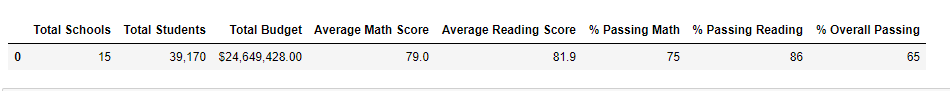

You'll note, in our first run of this table, we formatted the averages and percentages to 1 decimal place.

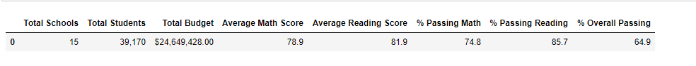

In the above image, the percentages are formatted to whole numbers.

## Key Metrics by School

The following tables demonstrate the key metrics by school.

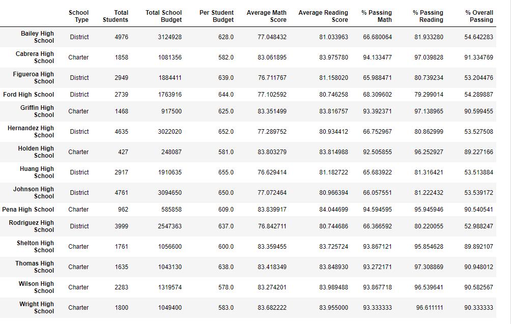

You will note the Thomas High School metrics.  

Because the 9th grade scores at this school were considered to be unusable, they were removed and the percentages recalculated to reduce the totals at Thomas High School without the 9th grade numbers.  The following image shows what those numbers would have looked like if we had not adjusted the totals:

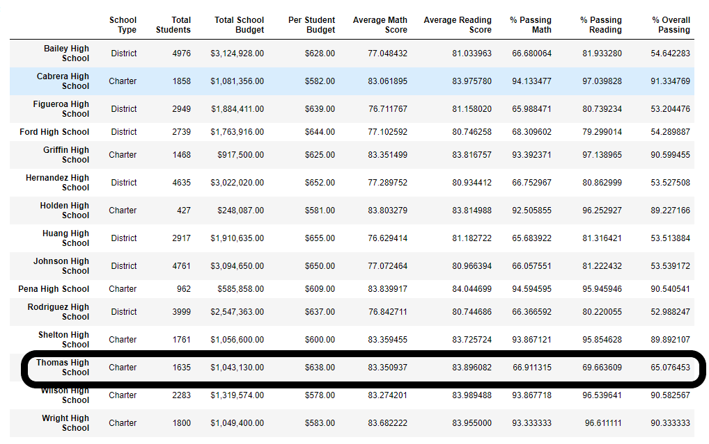

Finally, the adjusted high-level summary indicates the results after re-running the analysis with the adjusted Thomas High School numbers:

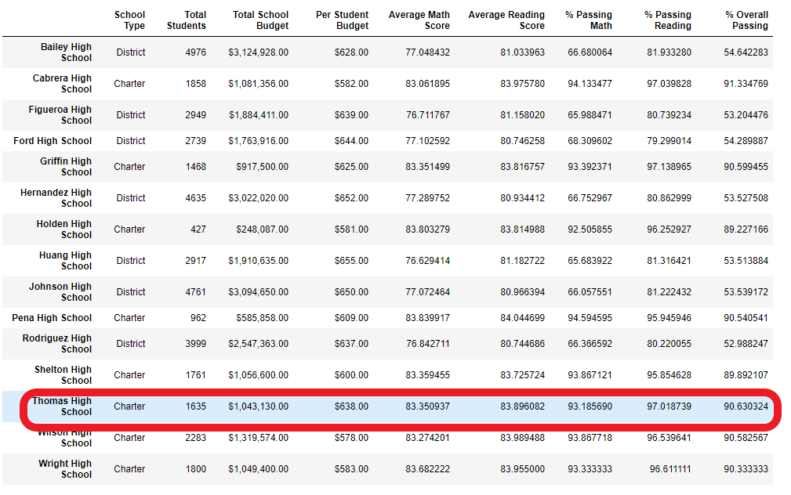

## Additional Metrics

### Top 5 and bottom 5 performing schools, based on the overall passing rate

The first analysis performed resulted in the following Top 5 and Bottom 5 schools based on overall passing rate:

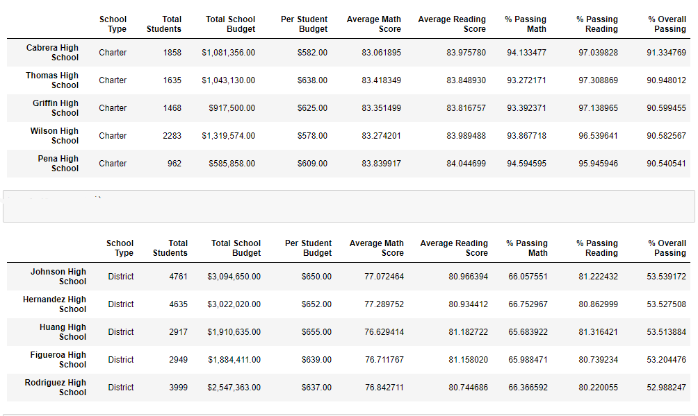

Our second analysis provided the following:

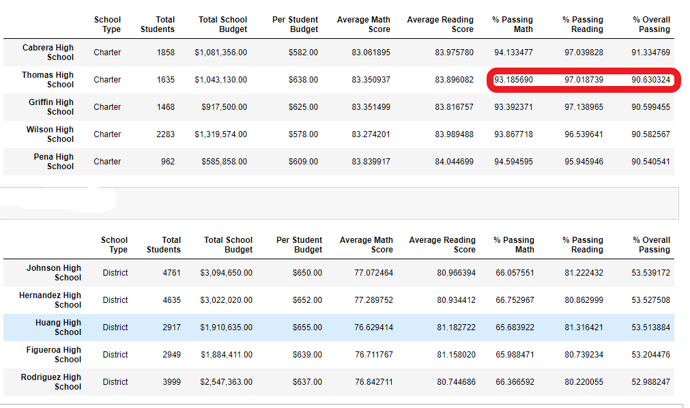

Note the change in the passing percentages after the removal of the 9th grade scores at that school.

### The average math score received by students in each grade level at each school

Following are the average Math and Reading scores by Grade:

 #### Average Math Scores by Grade - First Analysis
 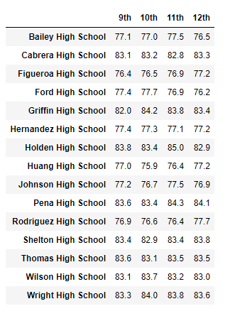
 
 #### Average Reading Scores by Grade - First Analysis
 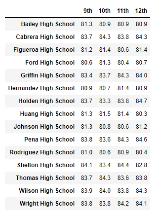

 #### Average Math Scores by Grade - Second Analysis
 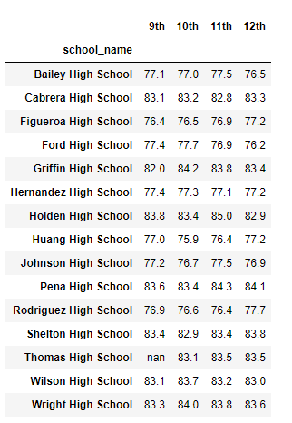

 #### Average Reading Scores by Grade - Second Analysis

 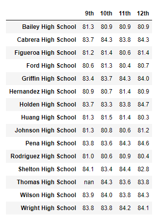


### School performance based on the budget per student

Following table depicts school performance based on budget per student - First Analysis
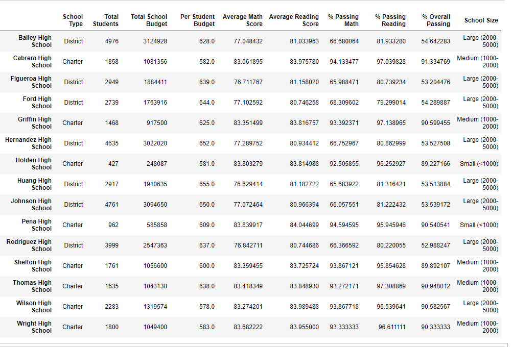

Second Analysis:
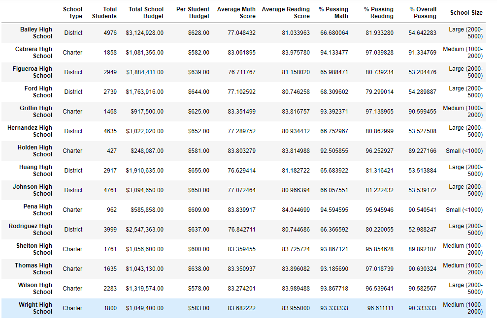

### School performance based on the school size 
Following are the results for school performance based on school size - First Analysis:
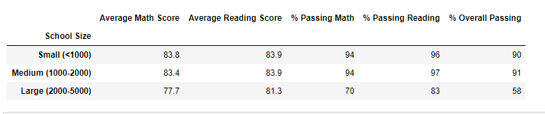

Second Analysis:
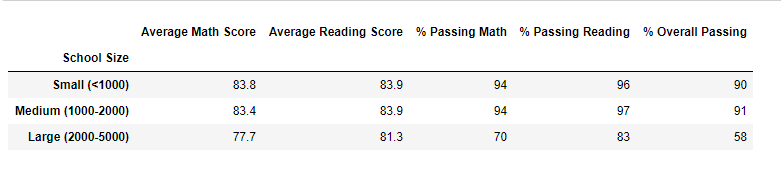


### School performance based on the type of school
Following is the result for school performance based on type of school - First analysis
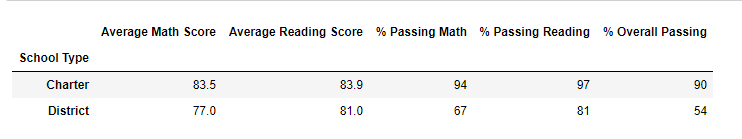

Second Analysis:
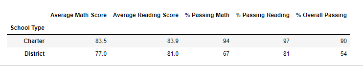

# Summary
School performance seemed to be less about Budget spent per student as many of the large schools had high budgets per student, but poor performance results.  The data shows that small and medium sized schools out performed large schools.  Finally, the data indicates that the type of school clearly matters as Charter schools greatly performed the District schools.


